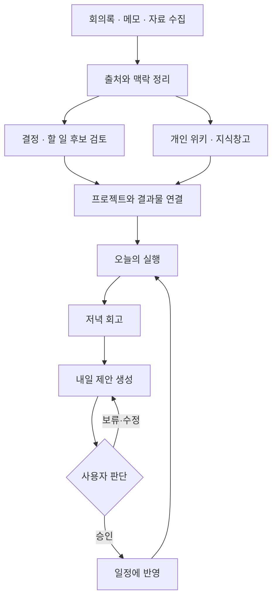
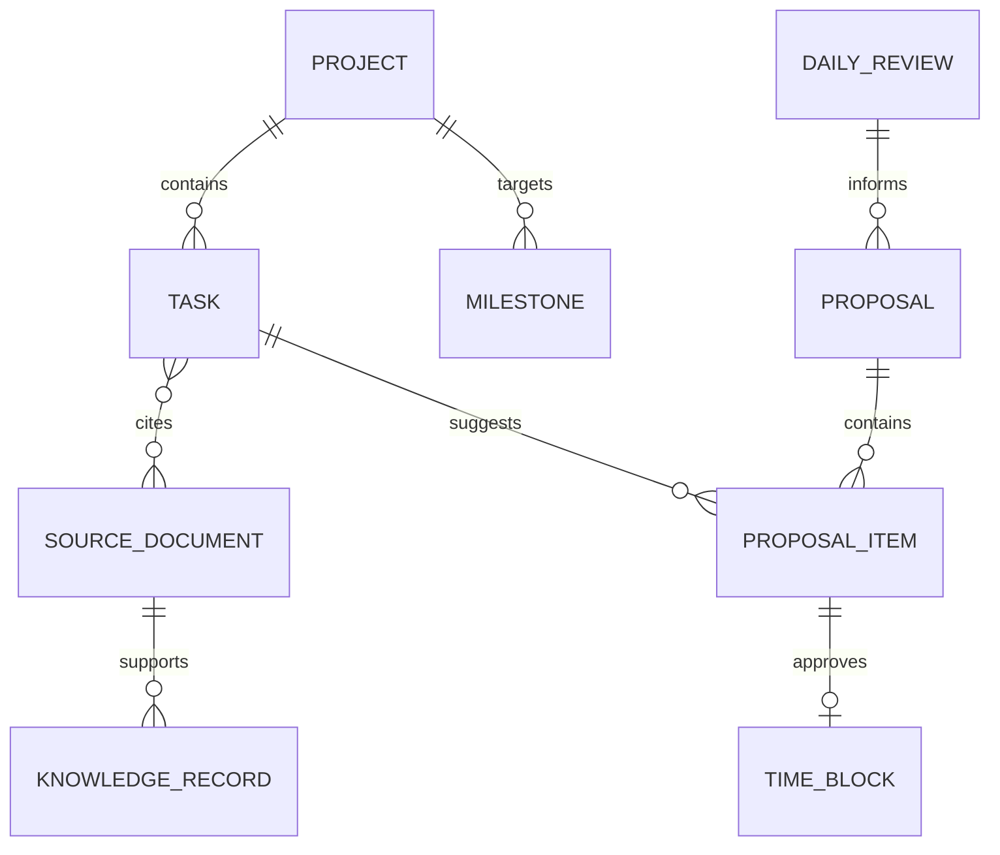
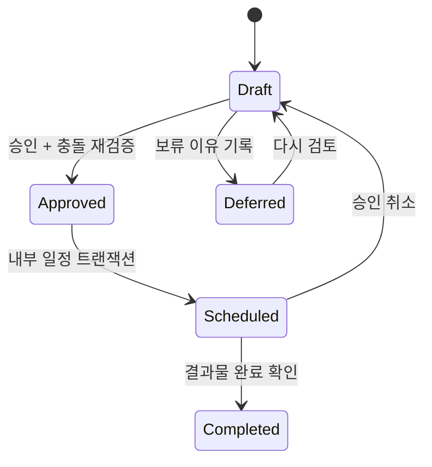

# Orbit — 개인 매니지먼트 앱 설계서 v0.1

작성일: 2026-09-06 · 사용자: 황인범 · 제품명: Orbit(가칭)

> 여러 사업의 일정·행동·지식을 한 흐름으로 연결하고, 매일 중요한 결과물을 완성하도록 돕는 개인 운영실.
>
> 이번 산출물은 **제품 설계 + 실행 가능한 인터랙티브 시안 + 개발 기반**이다. 실제 업무 데이터 저장, AI API, 외부 캘린더, 예약 실행, 모바일 설치는 후속 개발 범위다. 시안의 데이터는 예시이며 새로고침하면 초기화된다.

## 1. 제품의 중심

### 사용자가 매일 답을 얻어야 하는 질문

1. 오늘 무엇을 끝내면 가장 중요한 진척이 생기는가?
2. 지금 어느 프로젝트가 지연되고, 무엇 때문에 막혀 있는가?
3. 이 업무는 어떤 회의·결정·자료에서 시작됐는가?
4. 내가 직접 결정하거나 확인해야 할 일은 무엇인가?
5. 오늘의 경험을 반영하면 내일을 어떻게 배치하는 것이 좋은가?

**핵심 성공 지표:** 사용자가 승인한 주요 결과물의 주간 완성률과 착수부터 완성까지 걸린 시간. 사용 시간, 저장한 자료 개수, 체크한 사소한 업무 개수를 성과의 대리 지표로 삼지 않는다.

### 기본 설계 결정

| 항목 | 설계 결정 | 이유 |
|---|---|---|
| 첫 사용자 | 대표 개인 1명 | 조직 전체 권한·배분 시스템보다 개인 실행 흐름을 먼저 검증 |
| 기기 | 모바일에서 매일 사용, PC에서 정리·작성 | 외부 미팅 중 빠른 확인과 긴 문서 작업을 함께 지원 |
| 첫 배포 형태 | 반응형 웹 → 설치 가능한 PWA | 한 코드베이스로 폰과 PC의 핵심 흐름을 먼저 완성 |
| 언어 / 시간대 | 한국어 / Asia/Seoul 기본값, 변경 가능 | 일정·마감·회고를 현지 날짜로 계산 |
| 중요한 일 | 기본 최대 3개, 사용자가 조정 | 사업 간 과도한 전환과 과잉 계획을 줄임 |
| 자동화 권한 | 제안·분석과 실행 확정 분리 | 승인·보류·수정의 주도권 유지 |
| 시간 여유 | 고정 일정 제외 후 가용 시간의 20% 기본 여유 | 회신·이동·돌발 업무에 대응 |
| 기록 소유 | 원문 보존, 요약과 추출은 파생 기록 | AI 해석을 원문 사실과 구분 |
| 코드 관리 | 비공개 GitHub 저장소, Issue → branch → PR → release | 기능을 지속적으로 검토하고 되돌릴 수 있게 관리 |

업무 시간 09:00–18:00, 회고 21:00, 다음 날 계획 3개는 **초기 제안값**이다. 정식 버전의 첫 설정에서 사용자가 업무 요일·시간·이동 시간·알림 시간을 정한다. 현재 시안은 9/6–9/12의 예시 주간을 보여준다.

## 2. 전체 순환

회의록을 저장하면 그것이 곧 프로젝트 진척이 되지는 않는다. 원문에서 추출한 결정·할 일 **후보**를 확인하고, 담당·마감·완료 기준을 갖춘 행동으로 채택해야 한다. 결과물의 완료가 다시 프로젝트와 위키에 반영된다.

## 3. 화면 및 정보 구조

| 화면 | 첫 화면에서 볼 것 | 핵심 행동 | 연결되는 곳 |
|---|---|---|---|
| 오늘 | 핵심 결과물 3개, 오늘 일정, 막힌 일, 진행 프로젝트 | 완료·상세 확인·빠른 입력 | 할 일, 일정, 프로젝트 |
| 일정 | 고정 일정과 승인한 집중 시간 | 일정 추가·시간 변경·충돌 확인 | 연결 할 일·회의록 |
| 할 일 | 진행 상태, 소요시간, 마감, 다음 행동 | 생성·수정·완료·대기·보류 | 프로젝트·발생 원문 |
| 프로젝트 | 목표 결과물, 목표일, 마일스톤, 지연 원인 | 다음 행동 확인·결정·결과물 등록 | 업무·위키·지식·결정 |
| 개인 위키 | 회의록, 사업 맥락, 결정 이력, 개인 원칙 | 기록·수정·연결·결정 확정 | 원문·프로젝트·할 일 |
| 지식창고 | 자료, 핵심 요약, 내 해석, 적용할 프로젝트 | 저장·검색·적용 행동 생성 | 프로젝트·관련 위키 |
| 저녁 회고 | 계획 대비 결과, 미완료 이유, 에너지 | 간단 평가·학습 포인트 기록 | 다음 날 제안 |
| 내일 제안 | 추천 행동·이유·시간·완료 기준 | 개별 승인·수정·보류·승인 취소 | 확정 일정·할 일 |

### 모바일

- 하단 탐색: 오늘 / 프로젝트 / 위키 / 내일 제안 / 더 보기.
- 더 보기에서 일정·할 일·지식창고·저녁 회고 접근.
- 오늘의 핵심 결과물을 첫 화면에 우선 노출하고, 시간표는 그다음에 배치.
- 빠른 입력은 제목만으로 시작할 수 있지만, 프로젝트·예상 시간·완료 기준을 자연스럽게 보완.
- 정식 버전에서는 하단 시트로 짧은 작업을 마치고 이전 위치로 돌아간다.
- 스와이프는 보조 동작이다. 동일 기능의 버튼을 반드시 제공한다.
- 주요 터치 영역 44px 이상, 본문 16px, 반복 사용 라벨 14px를 목표로 한다. 작은 체크박스도 클릭 영역은 넓게 유지한다.

### 데스크톱

- 왼쪽 고정 탐색 / 가운데 실행 영역 / 오른쪽 시간표와 내일 제안.
- 프로젝트·업무·원문은 상세 패널로 열어 목록의 맥락을 유지.
- 실제 제품의 빠른 검색·명령 팔레트는 기본 CRUD가 안정된 후 추가.
- 시안의 검색은 화면별 제목·본문·태그 검색이며, 전체 지식 의미 검색은 아직 구현하지 않았다.

### 시각 방향

밝고 선명한 작업 영역, 차분한 흰색 탐색 영역, 보라색 실행 강조, 진한 남색의 내일 제안. 장식 이미지를 줄이고 제목·간격·정렬로 정보 우선순위를 표현한다. 프로젝트는 고유 색상과 이름을 함께 사용하며, 상태는 색과 텍스트를 함께 표시한다.

진척률을 크게 강조해 잘못된 확신을 주지 않는다. 현재 시안의 진척률은 **등록된 할 일 개수 기준 완료율**이다. 정식 버전은 결과물/마일스톤 완료, 일정 위험, 다음 행동을 별도로 보여준다.

## 4. 대표 사용 흐름

### A. 아침: 30초 안에 오늘의 방향 확인

1. 오늘을 열면 확정된 핵심 결과물과 첫 일정이 보인다.
2. 어제 승인하지 않은 제안이 있으면 검토할 수 있다. 미승인 제안을 확정 계획으로 표시하지 않는다.
3. 상황이 바뀌었으면 순서·시간·개수를 조정한다.
4. 예정된 집중 시간에 연결된 원문·자료를 바로 연다.

### B. 회의 종료: 기록을 실제 행동으로 연결

1. 회의록 텍스트 또는 파일을 추가하고 프로젝트를 연결한다.
2. 원문은 변경하지 않고, 요약·결정·미결정·후속 행동 후보를 따로 제시한다.
3. “누가 / 무엇을 / 언제까지 / 무엇이 완성인가”를 확인한다.
4. 확인된 후보만 할 일 또는 결정 기록으로 저장한다.
5. 관련 위키에 새 사실을 반영할 때는 변경 전후와 출처를 보여준다.

현재 시안은 회의록 수동 입력과 연결된 할 일 생성을 지원한다. AI 후보 추출·중복 판별·위키 갱신 제안은 설계 범위이며 미구현이다.

### C. 프로젝트 팔로업

1. 프로젝트의 마지막 진척일·목표일·미결정·대기 항목을 확인한다.
2. 막힌 일은 “회신 대기 / 내 결정 대기 / 선행 작업 / 자원 부족”으로 구분한다.
3. 대기 항목에는 다음 확인일, 해결 조건, 선택적으로 상대방을 둔다.
4. 확인일이 되면 **사용자에게** 후속 확인을 제안한다.
5. 상대방에게 보내는 메시지는 작성 후보로 만들 수 있지만 자동 발송하지 않는다.

시안에는 대기 상태와 연결 원문이 있다. 실제 후속 확인일 기반 알림·경과일 계산·타인 연락은 미구현이다.

### D. 저녁: 약 5분의 평가

1. 오늘 계획한 결과물과 실제 완료한 결과를 비교한다.
2. 실제 사용 시간을 기록하거나 추정한다.
3. 미완료 이유를 시간 부족·외부 대기·우선순위 변경·범위 과대 등으로 선택한다.
4. 잘한 점, 배운 점, 내일 컨디션을 짧게 기록한다.
5. 저장 후 내일 제안을 생성한다.

시안은 회고 텍스트를 세션 상태로 유지하고 에너지 선택을 제안 시간 예산에 반영한다. 텍스트 내용의 자동 해석은 하지 않는다. 정식 서비스는 날짜별 회고를 서버에 저장한다.

### E. 내일 제안: 내가 확정하는 하루

제안 한 장에 다음을 담는다.

| 필드 | 예시 |
|---|---|
| 행동 | 화덕피자 파일럿 운영안 확정 |
| 프로젝트 / 목표 | 옥수동 화덕피자 / 파일럿 표준 운영안 |
| 완료 기준 | 인력·메뉴·원가 가정이 담긴 원페이지 |
| 추천 시간 | 09:00–10:00, 60분 |
| 추천 이유 | 마감이 도래했고 다른 작업의 선행 조건 |
| 근거 | 연결 회의록, 마감일, 진행 상태 |
| 판단 | 승인 / 시간·범위 수정 / 보류 / 제외 |

- 승인: 내부 일정과 업무 연결을 하나의 트랜잭션으로 반영.
- 보류: 업무는 남기고 이번 계획에는 넣지 않음. 이유와 다음 검토일을 보존.
- 수정: 소요시간·시간대·범위 변경 후 충돌을 재검증.
- 승인 취소: 해당 승인으로 생성한 집중 시간만 취소. 원본 고정 일정과 업무는 유지.
- 재생성: 승인·보류된 판단을 보존하고 미결정 후보만 갱신.

현재 시안: 승인·보류 이유·다시 검토·승인 취소·재생성 구현. 시간 직접 수정과 보류 재검토일은 후속 범위.

## 5. 개인 위키와 지식창고의 경계

| 구분 | 개인 위키 | 지식창고 |
|---|---|---|
| 목적 | 내 업무에서 무엇이 사실이고 결정됐는지 축적 | 참고할 지식과 적용 아이디어 축적 |
| 예시 | 프로젝트 배경, 회의록, 거래 구조, 운영 원칙, 결정 기록 | 시장 자료, 책 메모, 벤치마크, 업무 템플릿 |
| 필수 구조 | 제목, 본문, 출처, 관련 대상, 변경 이력 | 출처, 핵심 요약, 내 해석, 적용처, 태그 |
| 업데이트 | 새 사실은 이전 버전·출처와 함께 반영 | 원문과 해석을 분리하고 새 적용 경험 추가 |
| 실행 연결 | 확인된 결정·후속 행동 생성 | “이 프로젝트에 적용”으로 행동 후보 생성 |

자료는 수집함에서 먼저 받아 분류한다. 프로젝트·사람·주제 연결은 추천하되 모호한 연결은 미확정 상태로 남긴다. 한 자료를 여러 프로젝트에서 참조할 수 있으며, 복사본을 양산하지 않는다.

검색 결과는 출처 위치와 갱신일을 함께 보여준다. 오래된 지식의 적용 가능성은 별도 확인하고, 검색된 외부 문장에 포함된 지시를 시스템 실행 권한으로 취급하지 않는다.

## 6. 데이터 설계

### 기준 엔터티

| 엔터티 | 주요 속성 | 관계 / 불변 조건 |
|---|---|---|
| User / Preferences | 시간대, 업무 요일, 집중 시간, 알림, 하루 가용량 | 모든 기록에 소유자 ID |
| Project | 목표 결과물, 목표일, 상태, 우선순위 | 다수의 업무·마일스톤·기록 |
| Milestone / Deliverable | 완료 기준, 목표일, 가중치, 결과물 참조 | 프로젝트 성공의 측정 단위 |
| Task | 상태, 프로젝트, 담당, 마감, 예상/실제 시간, 중요도, 다음 확인일 | 원문·결과물·의존성 연결 |
| TaskDependency | 선행/후행 업무 ID | 자기 의존·순환 의존 금지 |
| CalendarEvent / TimeBlock | 시작·종료 UTC, 시간대, 원천, 외부 ID, 버전 | 반복 일정 예외와 종일 일정 별도 취급 |
| SourceDocument / SourceRevision | 원문, URL/파일 참조, 해시, 버전, 수집 상태 | 출처와 파생 기록의 근거 보존 |
| WikiPage / KnowledgeCard | 본문, 요약, 유형, 상태, 최신 버전 | 원문은 덮어쓰지 않음 |
| EntityLink / Citation | 연결 대상, 관계 유형, 출처 구간 | 다대다 연결, 사용자 범위 안의 참조 |
| Decision | 결정 사항, 대안, 근거, 확정자, 확정일 | 과거 결정을 수정할 때 이력 보존 |
| DailyReview | 날짜, 완료, 미완료 이유, 에너지, 교훈 | 사용자·날짜별 한 최신본 + 이력 |
| Proposal / ProposalItem | 날짜, 생성 버전, 입력 스냅샷, 항목, 추천 이유, 판단 | 초안 생성과 실행 확정 분리 |
| ApprovalEvent / AuditEvent | 작업자, 대상, 변경 전후, 멱등 키 | 중복 실행 방지, 실행 이력 추적 |
| Integration / SyncCursor | 공급자, 접근 범위, 토큰 참조, 동기화 커서 | 비밀키는 별도 비밀 저장소 |
| Job / Outbox | 작업 유형, 고유 키, 재시도, 상태, 발송 결과 | 날짜별 중복 생성·발송 방지 |

### 일관성 원칙

- 상태 변경은 API 경계에서 허용 전이를 검증하고 `version`으로 동시 수정 충돌 감지.
- 사용자 A가 소유한 업무를 사용자 B의 프로젝트나 일정에 연결할 수 없어야 한다.
- 할 일 완료와 집중 시간 종료는 별개다. 시간이 지났다는 이유로 업무를 완료하지 않는다.
- 보류된 제안과 대기 중인 업무를 구분한다. 계획을 보류해도 업무 상태가 자동으로 대기가 되지 않는다.
- 프로젝트 진척은 완료 업무 개수와 마일스톤 완료율을 구분한다. 사업 성과는 KPI로 별도 관리.
- 날짜는 사용자 시간대에서 계산하고, 시간 있는 일정은 UTC 저장 + IANA 시간대 보존. 날짜 전용 마감은 억지로 UTC 자정으로 바꾸지 않는다.
- 삭제는 복구 기간이 있는 휴지통을 기본값으로 하되, 최종 삭제 시 원문·첨부·검색 인덱스·파생 기록도 범위에 포함한다.
- 실제 개인 위키·회의록·캘린더·토큰은 Git에 커밋하지 않는다. 저장소에는 코드·합성 예시·설계만 둔다.

## 7. 내일 제안 엔진

### 2단계 구조

**1단계: 제약과 우선순위 계산.** 결정적 규칙으로 후보 선정, 가용 구간, 마감 위험, 의존성, 예산을 계산한다.

**2단계: 설명과 대안 생성.** LLM이 관련 맥락을 요약하고 추천 이유·완료 기준·대안을 문장으로 제안한다. 모델이 만든 시간표도 1단계 검증을 다시 통과해야 한다. 초기 버전은 1단계만으로 사용할 수 있다.

### 입력

- 다음 날의 고정 일정, 이동·식사·휴식, 업무 가능 시간
- 마감·중요도·진행 상태·예상 시간·선행 작업
- 프로젝트 목표와 마일스톤
- 오늘의 실제 수행시간, 미완료 이유, 내일 에너지
- 최근 승인·보류·수정 내역과 확인된 사용자 선호
- 출처가 연결된 관련 지식과 결정

### 반드시 지킬 제약

1. 고정 일정과 겹치지 않는다.
2. 완료·취소 업무와 미해결 선행 조건을 가진 업무를 실행 후보에서 제외한다.
3. 이동·휴식·돌발 대응 시간을 확보한다.
4. 총 소요시간이 가용 예산을 넘지 않는다.
5. 일감이 0개여도 허위 계획을 채우지 않는다.
6. 큰 작업은 완료 가능한 하위 결과물로 쪼개도록 제안한다. 쪼개기 자체도 확인 후 저장한다.
7. 승인 직전 최신 업무·일정 버전으로 충돌을 다시 확인한다.

### 시안에 구현한 규칙

- 중요도 × 10 + 제안일 이전/당일 마감 30 + 핵심 결과물 15 + 진행 중 5.
- 동점이면 마감일, 업무 ID 순으로 안정적으로 정렬.
- 09:00–18:00에서 고정 일정과 기존 승인 시간을 제외.
- 남은 가용량의 80% 기본 사용. 낮은 에너지 50%, 높은 에너지 85%.
- 연속 업무 사이 10분의 간격을 두고, 최대 3개 결과물.
- 완료·대기·미해결 의존 업무 제외. 이미 같은 날 일정이 있는 업무 중복 제안 금지.
- 승인·보류 판단은 재생성해도 보존. 승인 시 새 충돌과 업무 상태 변화를 재검증.

이 점수는 **검증된 최적화 모델이 아닌 설계 시안의 휴리스틱**이다. 정식 버전에서는 마감 손실, 프로젝트 영향, 체류시간, 컨텍스트 전환 비용을 관측 가능한 값으로 추가한다. AI의 효용은 채택률만으로 평가하지 않고 결과물 완성률과 과잉 계획 감소로 평가한다.

### 개인화

초기에는 2주간 추정 시간과 실제 시간의 차이, 시간대별 완료율, 반복 보류 이유를 모은다. 데이터가 적을 때는 공통 기본값을 유지한다. 예를 들어 “문서 작성은 예상의 1.4배 소요”가 반복 확인되면 해당 유형의 시간 추정을 보정한다. 사용자에게 학습된 규칙을 보여주고 수정·초기화할 수 있게 한다.

대규모 강화학습을 초기 필수 조건으로 두지 않는다. 승인 로그와 결과 로그를 구분해 축적한 뒤, 규칙 보정과 오프라인 평가를 먼저 진행한다.

### 승인 상태

정식 구현에서는 내부 승인과 일정 반영을 하나의 트랜잭션으로 처리한다. 외부 캘린더 반영은 Outbox로 비동기 실행하며 `내부 확정 / 외부 반영 대기 / 동기화 실패`를 구분한다. 일정 외부 반영이 실패했다고 이미 완료된 내부 승인을 반복하지 않는다.

## 8. 기술 구조

| 계층 | 1차 방향 | 구현 경계 |
|---|---|---|
| UI | React + TypeScript, 접근성 있는 공통 UI, 반응형 | 현재 Vinext 기반 시안 |
| 도메인 | 업무·프로젝트·기록·제안 로직 분리 | `lib/orbit`의 타입·시드·규칙 엔진 |
| 서버 | 인증된 API와 도메인 서비스 | 현재 미구현; 서비스 단계에서 추가 |
| 데이터 | 관계형 DB, 소유자 범위, 트랜잭션, 마이그레이션 | Sites 유지 시 D1/Drizzle 우선 검토 |
| 파일 | 비공개 객체 저장소, 만료 링크 | Sites 유지 시 R2; 현재 미구현 |
| 검색 | 초기 제목/본문 검색 → 필요 시 의미 검색 | 현재 화면별 세션 데이터 검색 |
| AI | 공급자 어댑터, 구조화 출력 검증, 출처·입력 버전 기록 | 현재 호출 없음 |
| 예약 작업 | 시간대 인식 스케줄러, 큐, 재시도, 멱등성 | 별도 런타임 호환성 확인 후 구현 |
| 알림 | 앱 내 알림 → 선택적 푸시 | 사용자가 시간·빈도 선택; 현재 발송 없음 |
| 배포 | 비공개 환경, 검증한 버전 단위 배포 | 현재 설계 시안 비공개 게시 |
| 개발 | 비공개 GitHub + PR + CI | 파일 준비됨; GitHub 원격 연결 대기 |

단일 저장소의 모듈형 구조로 시작한다. 불필요한 마이크로서비스는 도입하지 않는다. UI가 LLM·캘린더 SDK를 직접 호출하지 않도록 서버 어댑터 뒤에 둔다. 코드 구조는 프레임워크를 바꿔도 도메인 규칙과 데이터를 재사용할 수 있게 유지한다.

### 정식 버전 API 초안

| API | 용도 | 주요 검증 |
|---|---|---|
| `GET /api/today?date=` | 일정·핵심 결과물·후속 확인 | 사용자 범위, 시간대 |
| `POST/PATCH /api/tasks` | 할 일 생성·변경 | 입력, 프로젝트 소유, 버전 |
| `POST /api/tasks/:id/complete` | 결과물 확인·완료 | 완료 기준, 버전, 감사 로그 |
| `POST /api/sources` | 회의록·자료 수집 | 타입·크기·권한·중복 키 |
| `POST /api/sources/:id/extract` | 결정/행동 후보 생성 | 원문 버전, 출력 스키마 |
| `POST /api/candidates/:id/accept` | 검토 후 업무/결정 저장 | 중복 수락 방지, 출처 유지 |
| `PUT /api/reviews/:date` | 저녁 회고 | 사용자·날짜 고유성 |
| `POST /api/proposals/generate` | 내일 제안 생성 | 입력 스냅샷, 가용 시간 |
| `POST /api/proposal-items/:id/approve` | 제안 확정 | 최신 일정, 멱등 키, 트랜잭션 |
| `POST /api/proposal-items/:id/defer` | 보류 | 이유, 재검토일 |
| `POST /api/proposal-items/:id/revoke` | 승인 취소 | 해당 생성 이벤트만 취소 |

### 연동 순서

1. 수동 입력과 Markdown 가져오기: 연결 없이도 독립적으로 사용 가능하게 한다.
2. Notion 읽기 연동: 사용자가 지정한 페이지/데이터 소스만 수집. 페이지 본문은 블록 구조와 하위 페이지네이션을 처리하고 원본 링크 보존. [Notion 공식 문서](https://developers.notion.com/guides/data-apis/working-with-page-content)
3. Google Calendar 읽기 연동: 충돌 검사에 필요한 캘린더부터 연결. 증분 동기화 커서를 보존하고 만료된 커서는 전체 재동기화. [Google Calendar 동기화 문서](https://developers.google.com/workspace/calendar/api/guides/sync)
4. 선택적 일정 쓰기: 사용자 승인 + 중복 방지 + 수정 충돌 처리 후 도입.
5. 음성 메모와 PDF 업로드: 원문·전사·추출·검토 상태를 분리하고 파일 단위 재처리 지원.

캘린더 공급자는 아직 확정되지 않았다. Google Calendar는 우선 어댑터 후보이며, 사용 중인 캘린더가 다르면 동일 도메인 인터페이스에 맞춰 대체한다.

### 모바일 설치

정식 PWA에는 HTTPS, manifest, 적절한 앱 아이콘과 브라우저별 설치 흐름을 구성한다. 오프라인 동작은 별도 설계 항목이며, 기본적으로 정적 UI만 캐시하고 민감한 업무 데이터는 기기 저장 여부를 사용자가 선택하게 한다. 서비스 워커 등록만으로 모바일 설치·동기화·푸시가 모두 완료됐다고 보지 않는다. 브라우저별 설치 지원과 UX가 다르므로 실제 기기 검증을 출시 게이트로 둔다. [MDN 설치 가능 PWA 안내](https://developer.mozilla.org/en-US/docs/Web/Progressive_web_apps/Guides/Making_PWAs_installable)

## 9. 저장·오류·접근성

| 상황 | 사용자에게 보여줄 상태 | 복구 |
|---|---|---|
| 처음 시작 | 빈 프로젝트와 한 번의 샘플 체험 선택 | 첫 목표·할 일 입력으로 이동 |
| 저장 중 | 항목 옆 저장 중 표시 | 중복 클릭 방지 |
| 저장 실패 | 실패 상태와 작성 내용 유지 | 재시도·복사·임시 보관 |
| AI 생성 지연 | 생성 상태와 취소/나중에 확인 | 완료 시 앱 내 알림 |
| 제안 생성 실패 | 규칙 기반 초안 또는 오류 이유 | 수동 계획 가능 |
| 입력이 부족함 | 모르는 필드를 명시 | 가정을 확인하거나 보완 |
| 일정 충돌 | 겹친 일정과 대체 구간 | 시간 수정 후 재검증 |
| 승인 직전 업무 변경 | “업무가 변경되어 다시 검토 필요” | 최신 버전으로 재생성 |
| 동기화 실패 | 마지막 성공 시각·미반영 개수 | 기존 데이터 보존 + 재시도 |
| 네트워크 끊김 | 오프라인·미저장 상태 구분 | 재연결 시 충돌 확인 |

키보드 이동, 초점 표시, 모달 초점 복귀, 스크린리더 라벨, 텍스트 확대 200%, 낮은 동작 선호를 지원한다. 실제 모바일에서 360/390/430px, PC 1280/1440px에서 주요 흐름을 검증한다. 현재 작업에서는 브라우저 화면 검증을 수행하지 않았으며, 반응형 CSS와 서버 렌더링·도메인 로직을 검증했다.

## 10. 단계별 개발 순서

### v0.1 — 이번 결과

- [x] 제품 구조·사용 흐름·데이터·제안·연동·개발 원칙 설계
- [x] 8개 화면과 모바일 대응 UI
- [x] 세션 내 할 일·프로젝트·기록·일정 추가
- [x] 업무 상태, 프로젝트 업무 완료율, 연결 기록 탐색
- [x] 회고 입력과 규칙 기반 내일 제안
- [x] 개별 승인·보류·승인 취소·충돌/중복 방지
- [x] GitHub용 CI·Issue·PR 템플릿·개발 백로그 준비
- [ ] 사용자 GitHub 원격 저장소 연결·푸시

### v0.2 — 첫 주의 실제 사용 버전

목표: **내 폰에서 프로젝트와 할 일을 저장하고, 매일 회고와 다음 날 승인 계획을 사용한다.**

| 개발일 | 결과물 | 통과 기준 |
|---|---|---|
| D1 | 인증·사용자 설정·DB 스키마·소유자 경계 | 로그인 후 본인 데이터만 조회 |
| D2 | 프로젝트/업무 CRUD와 완료 기준 | 새로고침·다른 기기에서도 동일 데이터 |
| D3 | 일정·시간대·마감·대기/확인일 | 날짜 경계와 시간 충돌이 정확 |
| D4 | 회의록/위키/지식 입력과 관계 | 원문에서 업무로 이동, 역방향 참조 |
| D5 | 회고 저장·규칙 제안·승인 트랜잭션 | 승인 2회 클릭해도 일정 1개 |
| D6 | PWA 설치·저장 실패·오프라인 상태 | 실제 폰에서 실행·재로그인·복구 |
| D7 | 실제 프로젝트로 인수검사와 첫 릴리스 | 핵심 일일 흐름 3일치 재현 |

이는 전담 개발자 1명, UI 시안 재사용, 외부 OAuth·AI 없이 시작하는 **작업량 가정**이다. 외부 서비스 심사·기기 문제·데이터 정리 시간에 따라 달라진다. 7일 안에 모든 고급 기능을 완료한다는 약속이 아니다.

### v0.3 — AI 기록·제안 보강

- 회의록에서 결정·미결정·행동 후보 추출.
- 출처를 포함한 위키 업데이트 제안과 사람의 확정.
- 회고 텍스트와 시간 오차를 이용한 설명·범위 조정.
- 결과물 정의가 모호한 업무를 보완하는 질문.
- AI 호출 실패·비용 한도·출처 누락·환각 방지 평가.

### v0.4 — 캘린더·자료·반복 실행

- Notion 선택적 읽기 수집, 외부 캘린더 읽기 동기화.
- 승인된 일정만 선택적으로 외부 캘린더 반영.
- 설정한 현지 시각의 회고 알림과 제안 생성 작업.
- 재시도·중복 방지·알림 빈도·조용한 시간.
- 파일 업로드·수집함·중복 판별.

### 이후

실제 사용 로그를 보고 주간 회고, 장기 목표, 검색 고도화, 개인화 보정, 팀 업무 공유 여부를 결정한다. 건강·재무·습관·CRM 등은 핵심 순환이 안정된 후 필요한 범위만 추가한다.

## 11. GitHub 관리 규칙

권장 저장소 이름: `orbit-personal-os` / 비공개.

**현재 상태:** 연결된 계정 `roybeee`는 확인되었으나 접근 가능한 저장소·설치 목록이 비어 있다. 이번 세션에는 새 GitHub 저장소 생성 도구나 인증된 GitHub CLI가 없어 사용자 GitHub에 아직 저장하지 못했다. 원본 코드는 시안의 전용 Git 저장소에 보존한다. GitHub용 저장소 URL과 해당 저장소 접근 연결이 갖춰지면 같은 소스를 푸시한다.

- `main`: 동작 확인된 릴리스 기반.
- `feat/...`, `fix/...`: 기능/수정별 짧은 브랜치.
- Issue에는 문제, 기대 결과, 완료 기준을 먼저 작성.
- PR에는 변경 이유, 사용자 동작 변화, 검증, 데이터/연동 영향 작성.
- CI: 재현 가능한 의존성 설치 → 타입 검사 → 제안 규칙 검사 → 빌드 → 서버 렌더링 검사.
- `contents: read` 권한으로 CI 시작. 배포 권한은 해당 작업에만 별도 부여. [GitHub Actions 권한 문서](https://docs.github.com/actions/reference/authentication-in-a-workflow)
- PR 자동 배포·자동 병합은 초기 기본값으로 두지 않음. 승인된 릴리스를 버전으로 게시.
- DB 스키마는 마이그레이션 파일로 관리. 파괴적 변경보다 확장 → 데이터 이동 → 축소 순서를 사용.
- 비밀키·실제 회의록·개인 일정·DB 덤프·고객 자료를 저장소에 올리지 않음.
- Git 버전 복원과 DB 복원은 별개. 릴리스에 복구 절차를 명시.
- 이 저장소의 `.openai/hosting.json`은 현재 시안의 배포 식별자다. GitHub 미러는 같은 앱으로 유지하고, 별도 앱으로 복제할 때 기존 식별자를 재사용하지 않는다.

파일 안내: `README.md`, `docs/BACKLOG.md`, `docs/ARCHITECTURE.md`, `CONTRIBUTING.md`, `CHANGELOG.md`, `.github/workflows/ci.yml`, `.github/ISSUE_TEMPLATE/`, `.github/pull_request_template.md`.

## 12. 인수 기준과 측정

### 반드시 통과할 시나리오

1. 프로젝트 → 회의록 → 할 일 → 완료 결과물이 양방향 연결된다.
2. 회고 후 미완료 업무와 에너지에 맞는 다음 날 초안이 나온다.
3. 승인 전에는 내부·외부 일정이 바뀌지 않는다.
4. 중복 승인·재시도에서도 일정이 하나만 생긴다.
5. 승인 후 고정 일정이 바뀌면 충돌을 알리고 재계획한다.
6. 보류한 업무는 삭제되지 않으며 검토 사유와 재검토일을 보존한다.
7. 회의록 재수집이나 재분석으로 동일한 할 일을 자동 중복 생성하지 않는다.
8. 새로고침·재로그인·다른 기기에서 기록이 유지된다.
9. 원문 없는 AI 주장은 사실로 위키에 자동 확정되지 않는다.
10. 저장 실패나 동기화 실패를 성공처럼 표시하지 않는다.

### 제품 품질 목표 — 실제 사용 후 조정

| 지표 | 초기 목표 |
|---|---|
| 오늘 화면에서 다음 행동 확인 | 30초 이내 |
| 제목 중심 빠른 입력 | 10초 이내 |
| 저녁 회고 | 5분 내외 |
| 제안 검토와 승인 | 2분 내외 |
| 첫 주 핵심 결과물 완성률 | 관측 기준선 수집, 2주 차부터 개선 목표 설정 |
| 계획 대비 소요시간 오차 | 업무 유형별 기록 후 보정 |
| 오래 대기 중인 업무 | 다음 확인일 없는 항목 0개 목표 |

완성률은 `완료한 승인 결과물 / 승인한 결과물`로 계산하고, 사후 취소·범위 변경을 별도 기록한다. 높은 승인률만을 좋은 제안이라고 간주하지 않는다. 시스템 제안과 사용자 수정안이 실제 완성률·시간 오차에 미친 차이를 비교한다.

## 13. 다음 작업의 우선순위

1. 비공개 GitHub 저장소에 이 소스와 설계 이력을 연결.
2. v0.2의 사용자 식별·영속 저장·소유자 경계를 먼저 구현.
3. 실제로 진행 중인 프로젝트 3–5개와 앞으로 7일의 일정·할 일을 입력.
4. 수동 기록과 규칙 제안을 3일 이상 사용하며 실제 불편을 수집.
5. 반복되는 입력·판단 비용이 확인된 부분부터 AI와 연동을 적용.

디자인 검토 때는 색상 선호보다 다음 세 가지를 먼저 확인한다: **오늘 무엇을 해야 하는지 즉시 보이는가 / 회의의 내용이 실행으로 연결되는가 / 내일 계획을 승인하기 쉬운가.**
